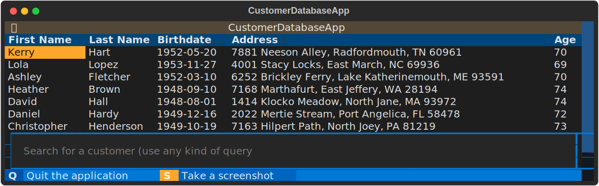
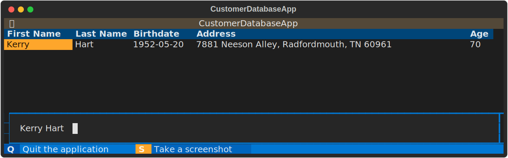
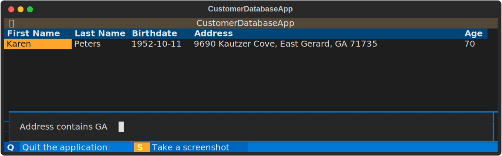

# llm-strategy

[](https://img.shields.io/github/v/release/blackhc/llm-strategy)
[](https://github.com/blackhc/llm-strategy/actions/workflows/main.yml?query=branch%3Amain)
[](https://codecov.io/gh/blackhc/llm-strategy)
[](https://img.shields.io/github/commit-activity/m/blackhc/llm-strategy)
[](https://img.shields.io/github/license/blackhc/llm-strategy)

Implementing the Strategy Pattern using LLMs.

Also, please see https://blog.blackhc.net/2022/12/llm_software_engineering/ for a wider perspective on why this could be important in the future.

This package adds a decorator `llm_strategy` that connects to an LLM (such as OpenAI’s GPT-3) and uses the LLM to "implement" abstract methods in interface classes. It does this by forwarding requests to the LLM and converting the responses back to Python data using Python's `@dataclasses`.

It uses the doc strings, type annotations, and method/function names as prompts for the LLM, and can automatically convert the results back into Python types (currently only supporting `@dataclasses`). It can also extract a data schema to send to the LLM for interpretation. While the `llm-strategy` package still relies on some Python code, it has the potential to reduce the need for this code in the future by using additional, cheaper LLMs to automate the parsing of structured data.

- **Github repository**: <https://github.com/blackhc/llm-strategy/>
- **Documentation** <https://blackhc.github.io/llm-strategy/>

## Example

```python
from dataclasses import dataclass
from llm_strategy import llm_strategy
from langchain.llms import OpenAI


@llm_strategy(OpenAI(max_tokens=256))
@dataclass
class Customer:
    key: str
    first_name: str
    last_name: str
    birthdate: str
    address: str

    @property
    def age(self) -> int:
        """Return the current age of the customer.

        This is a computed property based on `birthdate` and the current year (2022).
        """

        raise NotImplementedError()


@dataclass
class CustomerDatabase:
    customers: list[Customer]

    def find_customer_key(self, query: str) -> list[str]:
        """Find the keys of the customers that match a natural language query best (sorted by closeness to the match).

        We support semantic queries instead of SQL, so we can search for things like
        "the customer that was born in 1990".

        Args:
            query: Natural language query

        Returns:
            The index of the best matching customer in the database.
        """
        raise NotImplementedError()

    def load(self):
        """Load the customer database from a file."""
        raise NotImplementedError()

    def store(self):
        """Store the customer database to a file."""
        raise NotImplementedError()


@llm_strategy(OpenAI(max_tokens=1024))
@dataclass
class MockCustomerDatabase(CustomerDatabase):
    def load(self):
        self.customers = self.create_mock_customers(10)

    def store(self):
        pass

    @staticmethod
    def create_mock_customers(num_customers: int = 1) -> list[Customer]:
        """
        Create mock customers with believable data (our customers are world citizens).
        """
        raise NotImplementedError()
```

See [examples/customer_database_search.py](examples/customer_database_search.py) for a full example.







## Getting started with contributing

Clone the repository first. Then, install the environment and the pre-commit hooks with 

```bash
make install
```

The CI/CD
pipeline will be triggered when you open a pull request, merge to main,
or when you create a new release.

To finalize the set-up for publishing to PyPi or Artifactory, see
[here](https://fpgmaas.github.io/cookiecutter-poetry/features/publishing/#set-up-for-pypi).
For activating the automatic documentation with MkDocs, see
[here](https://fpgmaas.github.io/cookiecutter-poetry/features/mkdocs/#enabling-the-documentation-on-github).
To enable the code coverage reports, see [here](https://fpgmaas.github.io/cookiecutter-poetry/features/codecov/).

## Releasing a new version

- Create an API Token on [Pypi](https://pypi.org/).
- Add the API Token to your projects secrets with the name `PYPI_TOKEN` by visiting 
[this page](https://github.com/blackhc/llm-strategy/settings/secrets/actions/new).
- Create a [new release](https://github.com/blackhc/llm-strategy/releases/new) on Github. 
Create a new tag in the form ``*.*.*``.

For more details, see [here](https://fpgmaas.github.io/cookiecutter-poetry/features/cicd/#how-to-trigger-a-release).

---

Repository initiated with [fpgmaas/cookiecutter-poetry](https://github.com/fpgmaas/cookiecutter-poetry).
